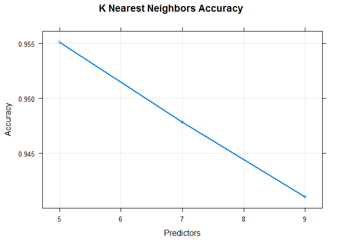

# Prediction Assignment Writeup
Csaba Miko  


# Objective

I want to identify how well the drumbell exercise was executed by a user of
accelerometers, based on data gathered from several people executing the exercise
correcly, and incorrectly in different ways.

The analysis is done on the training sets provided, tested against an independent
test set.


```r
library(readr)
library(ggplot2)
library(caret)

url1 <- "https://d396qusza40orc.cloudfront.net/predmachlearn/pml-training.csv"
url2 <- "https://d396qusza40orc.cloudfront.net/predmachlearn/pml-testing.csv"

if (!file.exists('./pml-training.csv'))  {
        download.file(url1, './pml-training.csv')
        }
if (!file.exists('./pml-testing.csv')) {
        download.file(url2, './pml-testing.csv')
        }

training <- read.delim("./pml-training.csv", na.strings=c("NA", "#DIV/0!"),
                       sep = ",", header = T)
testing <- read.delim("./pml-testing.csv", na.strings = c("", "NA", "#DIV/0!"),
                      sep = ",", header = T)
```

## Exploratory Analysis


```r
dim(training)
```

```
## [1] 19622   160
```

```r
sum(is.na(training)) / (dim(training)[1] * dim(training)[2])
```

```
## [1] 0.6131835
```

```r
table( training$new_window, is.na(training$kurtosis_roll_arm))
```

```
##      
##       FALSE  TRUE
##   no      0 19216
##   yes   328    78
```

```r
table( training$new_window, training$classe)
```

```
##      
##          A    B    C    D    E
##   no  5471 3718 3352 3147 3528
##   yes  109   79   70   69   79
```

```r
clean_training <- training[, colSums(is.na(training)) < nrow(training) * .95]

inTrain <- createDataPartition(clean_training$classe, p = 0.7, list = FALSE)
train1 <- clean_training[inTrain, ]
test1 <- clean_training[-inTrain, ]

set.seed(212131)
```

The dataset contains 19622 observations across 160 variables.
Approximately 61% of the data collected is NA.

The variables containing NA results is too high, with a distinct difference over
the new_window variable. 
There is no signficant correlation between classification and window.
I therefore remove all variables that contain NA values in at least 95% of the 
observations

This leaves a cleaned dataset with only 60 variables.

# Analysis

I want to define if it is possible to predict whether the drumbells exercise
was done correctly or not, and if with errors with what errors.
Predictors for the classification will be the acceleration data gathered from
accelerometers on the subject's body.

I am trying three different approaches to create a prediction model to define
the classification.


```r
fit1 <- train(classe ~ ., method = 'rpart', data = train1)
pr_fit1 <- predict(fit1)
```


```r
fit2 <- train(classe ~ ., method = 'kernelpls', data = train1)
pr_fit2 <- predict(fit2)
```


```r
fit3 <- train(classe ~ ., method = 'knn', data = train1, 
              preProcess = c("pca"))
pr_fit3 <- predict(fit3)
```


```r
confusionMatrix(train1$classe, pr_fit1)$overall["Accuracy"]
```

```
##  Accuracy 
## 0.6616437
```

```r
confusionMatrix(train1$classe, pr_fit2)$overall["Accuracy"]
```

```
##  Accuracy 
## 0.4681517
```

```r
confusionMatrix(train1$classe, pr_fit3)$overall["Accuracy"]
```

```
##  Accuracy 
## 0.9863871
```

The different models have a different accuracy level over the training dataset, 
with the 5 nearest neighbor classification model delivering a 98.6% accuracy.

Use the best model to deliver a prediction over the test data.


```r
print(fit3)
```

```
## k-Nearest Neighbors 
## 
## 13737 samples
##    59 predictor
##     5 classes: 'A', 'B', 'C', 'D', 'E' 
## 
## Pre-processing: principal component signal extraction (81), centered
##  (81), scaled (81) 
## Resampling: Bootstrapped (25 reps) 
## Summary of sample sizes: 13737, 13737, 13737, 13737, 13737, 13737, ... 
## Resampling results across tuning parameters:
## 
##   k  Accuracy   Kappa    
##   5  0.9551197  0.9432035
##   7  0.9478411  0.9339893
##   9  0.9410027  0.9253296
## 
## Accuracy was used to select the optimal model using  the largest value.
## The final value used for the model was k = 5.
```

```r
prediction <- predict(fit3, testing)
print(prediction)
```

```
##  [1] B A A A A E D B A A B B B A E E A B B B
## Levels: A B C D E
```

```r
plot(fit3, log = "y", lwd = 2, main = "K Nearest Neighbors Accuracy",
     xlab = "Predictors",
     ylab = "Accuracy")
```

<!-- -->

## Out of Sample Error

In sample error rate is 5.4% (1 - 0.946)


```r
predv <- predict(fit3, test1)
oose <- 1 - sum(predv == test1$classe) / length(predv)
print (oose)
```

```
## [1] 0.028887
```

Estimated out of sample error is 2.89%.
